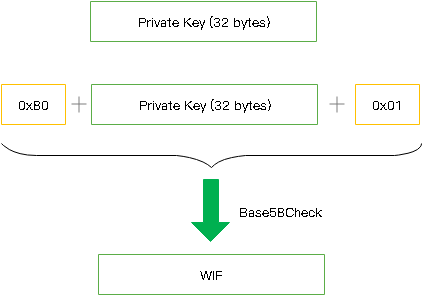
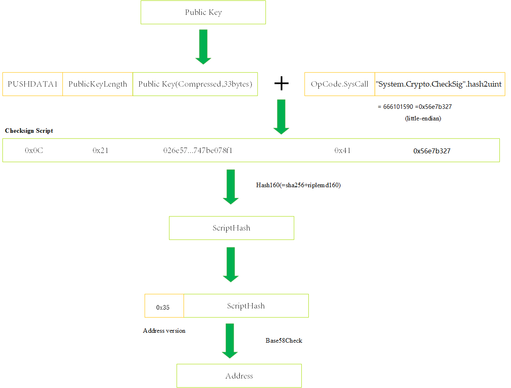
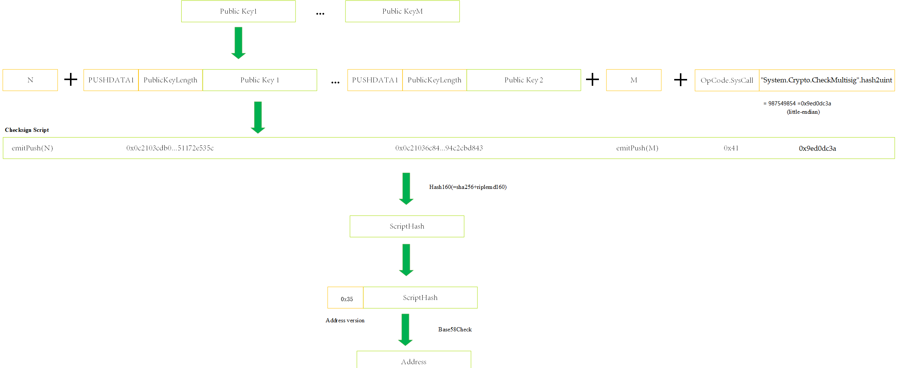
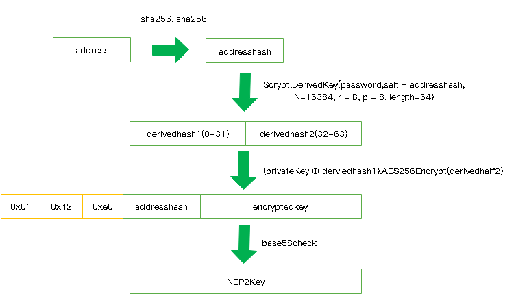

# Wallets

Wallets are basic components of Neo and the bridges for users to access the Neo network. They are responsible for transaction operations such as transfer, contract deployment, asset registration, etc.

You can redesign and modify Neo wallets following your own thoughts, but the below rules and patterns must be followed.

## Accounts

In Neo, the account is the smart contract and the address represents a contract script. The below flow diagram shows how to derive the public key from the private key and then to the address:


### Private Key

A private key is a random value generated between 1 and n (n is a constant, less than 2^256 slightly), and is represented by a 256 bit (32 bytes) number generally.

There are two main encoding formats for private keys in Neo:

- Hexstring Format

   The hexstring format is a string that uses hexadecimal characters to represent byte array.

- WIF Format

   The wif format is to add prefix `0x80` and suffix `0x01` in the original 32-byte data, and get the string after Base58Check encoding.



 Example: 

| Format | Value |
|---|---|
| byte[] | [0xc7,0x13,0x4d,0x6f,0xd8,0xe7,0x3d,0x81,0x9e,0x82,0x75,<br/>0x5c,0x64,0xc9,0x37,0x88,0xd8,0xdb,0x09,0x61,0x92,0x9e,<br/>0x02,0x5a,0x53,0x36,0x3c,0x4c,0xc0,0x2a,0x69,0x62] |
| hexstring | c7134d6fd8e73d819e82755c64c93788d8db0961929e025a53363c4cc02a6962 |
| wif | L3tgppXLgdaeqSGSFw1Go3skBiy8vQAM7YMXvTHsKQtE16PBncSU |

### Public Key

The public key is a point (X, Y) calculated through the ECC algorithm with the private key. The X, Y coordinates can be represented by 32-byte data. Different from Bitcoin, Neo chooses secp256r1 as the curve of the ECC algorithm. There are two public key formats in Neo:

- Uncompressed Public Key

    0x04 + X (32 bytes) +  Y (32 bytes) 

- Compressed Public Key

    0x02/0x03 + X (32 bytes)

Example:

| Format | Value |
|----------|:-------------:|
| Private Key | c7134d6fd8e73d819e82755c64c93788d8db0961929e025a53363c4cc02a6962|
| Public Key (Compressed) | 035a928f201639204e06b4368b1a93365462a8ebbff0b8818151b74faab3a2b61a |
| Public Key (Uncompressed)  | 045a928f201639204e06b4368b1a93365462a8ebbff0b8818151b74faab3a2b61a35dfabcb79ac492a2a88588d2f2e73f045cd8af58059282e09d693dc340e113f  |

### Address

Address is a string of numbers and letters after a series of transformations of the public key. This section will describes the steps of conversion from a public key to an address in Neo.

:::note

The address script in Neo N3 has changed not using the Opcode.CheckSig and OpCode.CheckMultiSig but the interoperable service call `SysCall "Neo.Crypto.CheckSig".hash2uint`, `SysCall "Neo.Crypto.CheckMultisig".hash2unit` instead.
:::

#### Ordinary Address

1. Build a `CheckSig` script with the public key, and the format is as follows:  


```0x0C + 0x21 + Public Key (Compressed 33 bytes) + 0x41 + 0x56e7b327```




2. Calculate script hash of the contract (20 bytes, make once SHA256 and RIPEMD160 of the script). 

3. Add the version prefix in the hash (Currently, the Neo protocol version is 53 and the corresponding byte is  `0x35`).

4. Make Base58Check encoding for the above byte data.

Example：

| Format | Value |
|----------|:-------------:|
| Private Key | 087780053c374394a48d685aacf021804fa9fab19537d16194ee215e825942a0 |
| Public Key (Compressed) | 03cdb067d930fd5adaa6c68545016044aaddec64ba39e548250eaea551172e535c |
| Script | 0c2103cdb067d930fd5adaa6c68545016044aaddec64ba39e548250eaea551172e535c4156e7b327 |
| Address | NNLi44dJNXtDNSBkofB48aTVYtb1zZrNEs |

#### Multi-Signature Address

1. Construct an N-of-M `CheckMultiSig` script with multiple addresses. The script format is as follows: 

   ```
   emitPush(N) + 0x0C + 0x21 + Public Key 1 (Compressed 33 bytes)  + .... + 0x0C + 0x21 + Public Key m (Compressed 33 bytes)  + emitPush(M) + 0x41 + 0x9ed0dc3a
   ```

   

2. Calculate script hash of the contract (20 bytes, make once SHA256 and RIPEMD160 of the script).

3. Add the version prefix in the hash. (Currently, the Neo protocol version is 53 and the corresponding byte is  `0x35`)

4. Make Base58Check encoding for the above byte data.

Example:

| Format                  | Value                                                        |
| ----------------------- | ------------------------------------------------------------ |
| Private Key             | 087780053c374394a48d685aacf021804fa9fab19537d16194ee215e825942a0<br/>9a973a470b5fd7a2c12753a1ef55db5a8c8dde42421406a28c2a994e1a1dcc8a |
| Public Key (Compressed) | 03cdb067d930fd5adaa6c68545016044aaddec64ba39e548250eaea551172e535c<br/>036c8431cc78b33177a60b4bcc02baf60d05fee5038e7339d3a688e394c2cbd843 |
| Script                  | 110c21036c8431cc78b33177a60b4bcc02baf60d05fee5038e7339d3a688e394c2cbd8430c2103cdb067d930fd5adaa6c68545016044aaddec64ba39e548250eaea551172e535c12419ed0dc3a |
| Address                 | NZ3pqnc1hMN8EHW55ZnCnu8B2wooXJHCyr                           |

:::note

Please pay attention to the interval of the number for the usage of `emitPush(number)`. Here is an example in the case of the number being BigInteger, where data = number.ToByteArray():
:::

| Number           | Emit OpCode                        | Value            |
| ---------------- | ---------------------------------- | ---------------- |
| -1 <= number <= 16  | OpCode.PUSH0 + (byte)(int)number | 0x10 + number   |
| data.Length == 1  | OpCode.PUSHINT8 + data | 0x00 + data   |
| data.Length == 2  | OpCode.PUSHINT16 + data | 0x01 + data   |
| data.Length <= 4  | OpCode.PUSHINT32 + data | 0x02 + PadRight(data, 4)   |
| data.Length <= 8  | OpCode.PUSHINT64 + data | 0x03 + PadRight(data, 8)   |
| data.Length <= 16  | OpCode.PUSHINT128 + data | 0x04 + PadRight(data, 16) |
| data.Length <= 32  | OpCode.PUSHINT256 + data | 0x05 + PadRight(data, 32) |

### The wallet address scripthash

When creating a wallet in Neo blockchain, the private key, public key, wallet address, and related scripthash are generated. 

Let's look at a standard wallet address and corresponding scripthash strings in big and little endian formats beneath. 

| Format                   |                   String                   |
| ------------------------ | :----------------------------------------: |
| Adress                   |     NUnLWXALK2G6gYa7RadPLRiQYunZHnncxg     |
| Big-endian Scripthash    | 0xed7cc6f5f2dd842d384f254bc0c2d58fb69a4761 |
| Little-endian Scripthash |  61479ab68fd5c2c04b254f382d84ddf2f5c67ced  |
| Base64 Scripthash        |        YUeato/VwsBLJU84LYTd8vXGfO0=        |

To convert between the wallet address and scripthash, or between big endian and little endian byte order, use the tool [Data Convertor](https://neo.org/converter).

## Wallet Files

### db3 files

The db3 wallet is commonly used in wallets of the exchange to facilitate a large amount of account information storage and the retrieval queries.

A db3 wallet file uses SQLite to store data, and the file name extension is `.db3`. There are four tables created in a db3 file：

- Account

  | Field               | Type          | isRequired | Note             |
  | ------------------- | ------------- | ---------- | ---------------- |
  | PrivateKeyEncrypted | VarBinary(96) | Yes        | AES256 encrypted |
  | PublicKeyHash       | Binary(20)    | Yes        | Primary Key      |

- Address

  | Field      | Type       | isRequired | Note        |
  | ---------- | ---------- | ---------- | ----------- |
  | ScriptHash | Binary(20) | Yes        | Primary Key |

- Contract

  | Field         | Type       | isRequired | Note                                               |
  | ------------- | ---------- | ---------- | -------------------------------------------------- |
  | RawData       | VarBinary  | Yes        |                                                    |
  | ScriptHash    | Binary(20) | Yes        | Primary Key，Foreign Key，associated Address table |
  | PublicKeyHash | Binary(20) | Yes        | Index，Foreign Key，associated Account table       |

- Key

  | Field | Type        | isRequired | Note        |
  | ----- | ----------- | ---------- | ----------- |
  | Name  | VarChar(20) | Yes        | Primary Key |
  | Value | VarBinary   | Yes        |             |

In `Key` table，it mainly stores the AES256 attributes:

- `PasswordHash`: the hash of the passowrd, by using SHA256 hash operation.

- `IV`: an initial vector of AES, randomly generated.

- `MasterKey`: an encrypted ciphertext, obtained by encrypting the private key using AES256 algorithm with `PasswordKey`, `IV` parameters.

- `Version`: the version of the wallet

The db3 wallet uses the AES (symmetrical encryption) as its encryption and decryption method.

### NEP6 files

An NEP6 wallet file complies with the NEP6 standard, and the file name extension is `.json`. The JSON format is as follows:

```json
{
    "name": null,
    "version": "3.0",
    "scrypt": {
        "n": 16384,
        "r": 8,
        "p": 8
    },
    "accounts": [
        {
            "address": "Nf8iN8CABre87oDaDrHSnMAyVoU9jYa2FR",
            "label": null,
            "isdefault": false,
            "lock": false,
            "key": "6PYM9DxRY8RMhKHp512xExRVLeB9DSkW2cCKCe65oXgL4tD2kaJX2yb9vD",
            "contract": {
                "script": "DCEDYgBftumtbwC64LbngHbZPDVrSMrEuHXNP0tJzPlOdL5BdHR2qg==",
                "parameters": [
                    {
                        "name": "signature",
                        "type": "Signature"
                    }
                ],
                "deployed": false
            },
            "extra": null
        }
    ],
    "extra": null
}
```
In this example the password is 1

| Field                           | Description                                                  |
| ------------------------------- | ------------------------------------------------------------ |
| name                            | a label that the user attaches to the wallet file            |
| version                         | currently it is 3.0                                          |
| scrypt（n/r/p）                 | (n/r/p) are parameters for scrypt algorithm used for encrypting and decrypting the private keys in the wallet |
| accounts                        | an array of Account objects which describe the details of each account in the wallet |
| account.address                 | account address                                              |
| account.label                   | account label, null by default                               |
| account.isDefault               | whether is the default account of wallet                     |
| account.lock                    | whether the account is locked                                |
| account.key                     | export nep2key of the privatekey                             |
| account.contract                | the contract of the script                                   |
| account.contract.script         | address script                                               |
| account.contract.parameters     | parameter list for the address script contract               |
| account.contract.parameter.name | parameter name for the address script contract               |
| account.contract.parameter.type | parameter name for the address script contract               |
| account.contract.deployed       | whether is deployed                                          |
| account.extra                   | additional attributes of the account, null by default        |
| extra                           | additional attributes of the wallet, null by default         |

An NEP6 wallet uses scrypt algorithm as the core method of wallet encryption and decryption.

#### Encryption steps



1. The address is derived from the public key, and the address hash is the first four bytes of `SHA256(SHA256(Address))`

2. Calculate a `derivedkey` by the scrypt algorithm, and divide the 64-byte data into two halves as `derivedhalf1` and `derivedhalf2` Scrypt uses the following parameters:

    - ciphertext: The entered password (UTF-8 format)
    - salt: address hash
    - n: 16384
    - r: 8
    - p: 8
    - length: 64

3. Do xor operation on the private key and `derivedhalf1`, and then get `encryptedkey` by using AES256 to encrypt it with `derivedhalf2`

4. Concatenate data according to the following format and obtain `NEP2Key` by using Base58Check encoding of it

    `0x01` + `0x42` + `0xe0` + address hash + `encryptedkey`

**Decryption steps**：

1. Decode NEP2Key by using Base58Check decoding

2. Check whether the length of decoded data is 39 bytes, and the first three bytes (data[0-2]) are `0x01`, `0x42` and `0xe0`

3. Take data[3-6] as `addresshash`

4. Put the password and addresshash into the Scrypt algorithm. Specify the result length to 64. Then get the `derivedkey`

5. Take Derivedkey[0-31] as `Derivedhalf1`, and Derivedkey[32-63] as `Derivedhalf2`

6. Take data[7-38] as `Encryptedkey` (32 bytes), and decrypt it using AES256 with `derivedhalf2` as the initial vector

7. Do xor operation on the decrypted data and `derivedhalf1` to obtain the private key

8. Get the public key from the private key with ECC algorithm, and then get the address. Check whether the first four bytes of the result of `SHA256(SHA256(Address))` is equal to the `addresshash`. If it's the same, then you get the correct private key

More details about NEP2 and NEP6 proposals are in the Neo document.

NEP2 proposal: https://github.com/neo-project/proposals/blob/master/nep-2.mediawiki

NEP6 proposal：https://github.com/neo-project/proposals/blob/master/nep-6.mediawiki

## Signature

Neo employs the `ECDSA` algorithm to sign the transaction through the wallet component and take the `nistP256` or `Secp256r1` as the ECC curve and SHA256 as the hash algorithm.

C# code：

```cs
        public static byte[] Sign(byte[] message, byte[] prikey, byte[] pubkey)
        {
            using (var ecdsa = ECDsa.Create(new ECParameters
            {
                Curve = ECCurve.NamedCurves.nistP256,
                D = prikey,
                Q = new ECPoint
                {
                    X = pubkey[..32],
                    Y = pubkey[32..]
                }
            }))
            {
                return ecdsa.SignData(message, HashAlgorithmName.SHA256);
            }
        }
```

Example:

| Format     | Value                                                        |
| ---------- | ------------------------------------------------------------ |
| data       | hello world                                                  |
| PrivateKey | f72b8fab85fdcc1bdd20b107e5da1ab4713487bc88fc53b5b134f5eddeaa1a19 |
| PublicKey  | 031f64da8a38e6c1e5423a72ddd6d4fc4a777abe537e5cb5aa0425685cda8e063b |
| signature  | b1855cec16b6ebb372895d44c7be3832b81334394d80bec7c4f00a9c1d9c3237541834638d11ad9c62792ed548c9602c1d8cd0ca92fdd5e68ceea40e7bcfbeb2 |

## Wallet Function

| Function Name   |  Description                                                  |
| ---------------- | ------------------------------------------------------------ |
| Import wallet file     |  Import the account information from the specified wallet file   |
| Export wallet file     |  Store the account information (including private key, password, address, etc.) in the specified wallet file such as db3 wallet file, nep6 json file.                |
| Unlock wallet         | Verify user password to prevent leaks                   |
| Create private key         | Recommend safe random generator                       |
| Import private key         | Add new private key to the wallet with wif format or digital certificate   |
| Export private key         | Export accounts' private key                       |
| Generate public key         | Obtain public key by ECC algorithm with private key |
| Generate address         |  Generate address based on private key               |
| Import address         | Add new address to the wallet                            |
| Export address         | Export accounts' address                               |
| Import offline data |  Load block data in `chain.acc` file to reduce synchronization time    |
| Export offline data | Export block data in `chain.acc` file                   |
| Synchronize block data     |                                                      |
| Transfer             | Transfer to other addresses                              |
| Sign             | Sign data, such as transactions                              |
| Claim Gas          | Claim the newly allocated gas from the neo held by the account |
| Get balance         | Show the balance of current wallet  |
| Get transaction         | Show transaction history of current wallet |
| Construct multi-signature contract | Construct multi-signature contract  |
| Extend         |                                                                |
| Deploy smart contract     |  Deploy smart contract |
| Test smart contract     | Test smart contract |

## Wallet software

### Full-node wallet

The full-node wallet is a complete backup of blockchain data, which saves all the onchain data and participates in p2p network, therefore it needs a large storage space.

Neo-CLI and Neo-GUI are all full-node wallet. For more information refer to [Neo node](../../node/introduction.md).

### SPV wallet

The SPV (Simplified Payment Verification) wallet is different from a full-node wallet. It doesn't store all block data, only block header data, and verifies the data by using bloom filter and merkle tree algorithm. It's mostly used in mobile app or light client, as it can save storage space effectively.

For developing SPV wallet, refer to the NEO network protocol interface.

Usage:

   1. The SPV wallet sends a bloom filter to the full node, and the full node loads the bloom filter.

   2. The SPV wallet sends the bloom filter's parameters to the full node, and the full node load the parameters. (Optional)

   3. The SPV wallet queries transactions from the full node, and the full node returns the transaction data after filtering with the bloom filter and the constructed merkle tree path.

   4. The SPV wallet uses the merkle tree path to verify the transaction data.

   5. The SPV wallet sends `clear the bloom filter` instruction to the full node, and the full node clear it.
