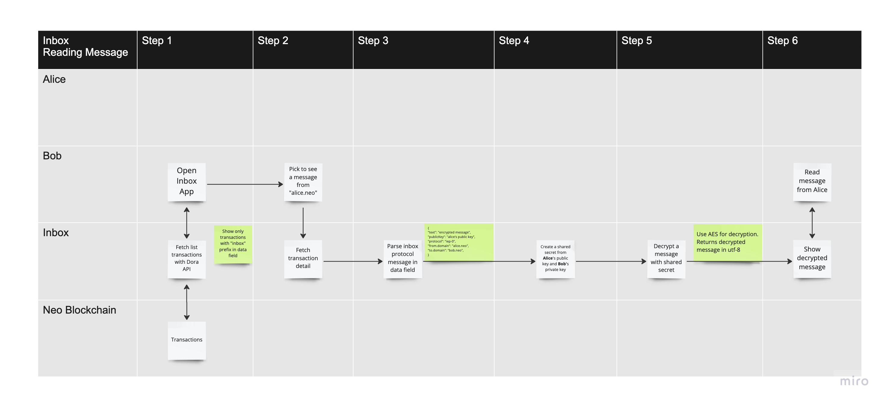

If you are familiar with ECDH, You might know that you need to be able to exchange a public key between two parties to generate a shared secret to encrypt and decrypt the data.

Exchanging a public key relies on having a centralized server to store your public key and the ability to retreive it.

With the new NeoNS recently launched, one of a great features about NeoNS is the ability to add multiple records to your .neo domain. Similar to what you are doing with a normal web domain name. i.e. CNAME, TXT, IP, etc. 
And the best part about this is — It's **decentralized.**

Let's dive in on how NeoNS can help make this happen.

Here is the flows explaining how it works.

Alice is sending Bob an encrypted message.   

Bob is reading a message from Alice.

First you need to set a record on you .neo domain with a [`setRecord`](/docs/n3/neons/api/setRecord) method. 

To retreive all records from a particular .neo domain, you will need [`getAllRecords`](/docs/n3/neons/api/getAllRecords) method.
Then you can check whether an owner of a domain has a public key registered in their records or not.

There you have it. Multiple records on NeoNS is a very powerful feature. Hope this can inspire you to build something!

You can read more about NeoNS API [here](/docs/n3/neons/index).

